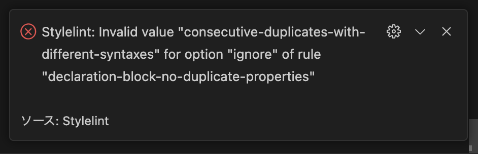

<!-- TOC -->

- [nuxt\_various](#nuxt_various)
  - [stylelint](#stylelint)
    - [エラー](#エラー)
  - [commit message のルール](#commit-message-のルール)
  - [Build Setup（デフォルトの README）](#build-setupデフォルトの-readme)
  - [Special Directories](#special-directories)
    - [`assets`](#assets)
    - [`components`](#components)
    - [`layouts`](#layouts)
    - [`pages`](#pages)
    - [`plugins`](#plugins)
    - [`static`](#static)
    - [`store`](#store)

<!-- /TOC -->

# nuxt_various

## stylelint

### エラー

- VSCode で stylelint がエラーが出ない

  - `.vscode/settings.json` に以下を追加し解決。

  ```json
  { "stylelint.validate": ["css", "scss", "sass", "html", "vue"] }
  ```

- `stylelint.config.js` に以下を追加し解決。

```javascript
module.exports = {
  // その他の設定
  rules: {
    'declaration-block-no-duplicate-properties': true,
  },
}
```

以下のエラーが出ていたので、従って解決した。
元々はこの設定がないと言われていたが、未設定だった。
明示的に設定することで解決した。



- Unknown word (CssSyntaxError)Stylelint(CssSyntaxError)
  - `yarn remove stylelint-config-prettier` で解決。（stylelint.config.js の extends からも削除） [参考](https://github.com/nuxt/create-nuxt-app/issues/1028)

## commit message のルール

commitlint によるコミットメッセージのルールを設定しています。

- build: ビルドシステムや外部依存関係の変更
- chore: 雑用。ビルドプロセスや補助ツールの変更
- ci: CI の設定やスクリプトの変更
- docs: ドキュメントのみの変更
- feat: 新機能の追加
- fix: バグ修正
- perf: パフォーマンスを向上させるコードの変更
- refactor: リファクタリング
- revert: コードの変更を取り消す
- style: コードの意味に影響を与えない変更（空白、フォーマット、セミコロンの欠落など）
- test: テストの追加、変更、削除

## Build Setup（デフォルトの README）

```bash
# install dependencies
$ yarn install

# serve with hot reload at localhost:3000
$ yarn dev

# build for production and launch server
$ yarn build
$ yarn start

# generate static project
$ yarn generate
```

For detailed explanation on how things work, check out the [documentation](https://nuxtjs.org).

## Special Directories

You can create the following extra directories, some of which have special behaviors. Only `pages` is required; you can delete them if you don't want to use their functionality.

### `assets`

The assets directory contains your uncompiled assets such as Stylus or Sass files, images, or fonts.

More information about the usage of this directory in [the documentation](https://nuxtjs.org/docs/2.x/directory-structure/assets).

### `components`

The components directory contains your Vue.js components. Components make up the different parts of your page and can be reused and imported into your pages, layouts and even other components.

More information about the usage of this directory in [the documentation](https://nuxtjs.org/docs/2.x/directory-structure/components).

### `layouts`

Layouts are a great help when you want to change the look and feel of your Nuxt app, whether you want to include a sidebar or have distinct layouts for mobile and desktop.

More information about the usage of this directory in [the documentation](https://nuxtjs.org/docs/2.x/directory-structure/layouts).

### `pages`

This directory contains your application views and routes. Nuxt will read all the `*.vue` files inside this directory and setup Vue Router automatically.

More information about the usage of this directory in [the documentation](https://nuxtjs.org/docs/2.x/get-started/routing).

### `plugins`

The plugins directory contains JavaScript plugins that you want to run before instantiating the root Vue.js Application. This is the place to add Vue plugins and to inject functions or constants. Every time you need to use `Vue.use()`, you should create a file in `plugins/` and add its path to plugins in `nuxt.config.js`.

More information about the usage of this directory in [the documentation](https://nuxtjs.org/docs/2.x/directory-structure/plugins).

### `static`

This directory contains your static files. Each file inside this directory is mapped to `/`.

Example: `/static/robots.txt` is mapped as `/robots.txt`.

More information about the usage of this directory in [the documentation](https://nuxtjs.org/docs/2.x/directory-structure/static).

### `store`

This directory contains your Vuex store files. Creating a file in this directory automatically activates Vuex.

More information about the usage of this directory in [the documentation](https://nuxtjs.org/docs/2.x/directory-structure/store).
